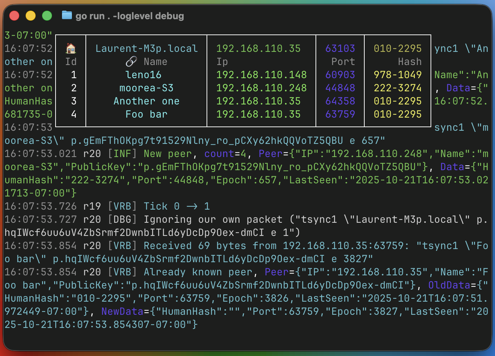

[](https://pkg.go.dev/fortio.org/tsync)
[](https://goreportcard.com/report/fortio.org/tsync)
[](https://github.com/fortio/tsync/actions/workflows/include.yml)
[](https://codecov.io/github/fortio/tsync)

# tsync

**WIP** (just started)

Cross platform terminal UI (tui) and network based synchronization of clipboard and files

Includes reusable library for network discovery and file/dir sync.

## What does it do / How does it work?

The program starts by figuring out which interface and local address to use (because on Windows the default picks the WSL virtual interface and thus fails to see real peers) by looking up a configurable target (defaults to UDP 8.8.8.8:53, i.e., one of Google's public DNS servers).

It then listens on a multicast address (default 239.255.116.115:29556), periodically sends its own information to that address, and reads information from discovered peers.

Currently, example of peer detection with tsync running on a mac, a linux and a windows box:




## Install
You can get the binary from [releases](https://github.com/fortio/tsync/releases)

Or just run
```
CGO_ENABLED=0 go install fortio.org/tsync@latest  # to install (in ~/go/bin typically) or just
CGO_ENABLED=0 go run fortio.org/tsync@latest  # to run without install
```

or even
```
docker run -ti fortio/tsync # but that's obviously slower
```

or
```
brew install fortio/tap/tsync
```


## Usage

```
tsync help
```
